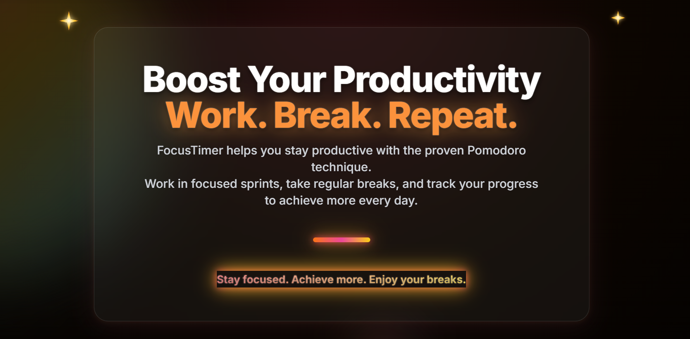

# 🚀 FocusTimer – Boost Your Productivity with Pomodoro Technique

<p align="center">
  
  <br />
  
</p>

> **A modern, visually stunning Pomodoro timer and productivity dashboard.**

[](https://focus-timer-nine-tau.vercel.app/)

---

## ✨ Features

- ⏲️ **Customizable Pomodoro Timer** – Set your own focus and break durations
- 📝 **Animated Task List** – Add, edit, and track your daily tasks
- 📈 **Today’s Progress** – Visualize your productivity with live stats
- 💎 **Modern UI/UX** – Glassmorphism, gradients, animated icons, and micro-interactions
- 🌈 **Theme Customization** – Pick your favorite timer colors
- 🦾 **Accessibility** – Keyboard navigation, screen reader support, and high contrast
- 📱 **Fully Responsive** – Looks great on desktop, tablet, and mobile
- ⚡ **Lightning Fast** – Optimized for performance and smooth animations

---

## 🖼️ Screenshots

<p align="center">
  <b>Main Dashboard</b><br />
  
  <br />
  <b>Features Overview</b><br />
  
</p>

---

## 🌍 Live Demo

👉 [https://focus-timer-nine-tau.vercel.app/](https://focus-timer-nine-tau.vercel.app/)

---

## 🛠️ Tech Stack

- **Framework:** [Next.js 15](https://nextjs.org/)
- **Styling:** [Tailwind CSS](https://tailwindcss.com/), Glassmorphism, Gradients
- **Animation:** [GSAP](https://greensock.com/gsap/), [Framer Motion](https://www.framer.com/motion/)
- **UI Components:** [Radix UI](https://www.radix-ui.com/), Custom SVGs
- **Icons:** [Lucide](https://lucide.dev/)
- **State & Persistence:** React Hooks, LocalStorage

---

## 🚦 How to Run Locally

```bash
# 1. Clone the repo
git clone https://github.com/nikhilsaini2/focus-timer-pro.git
cd focus-timer-pro

# 2. Install dependencies
npm install

# 3. Start the dev server
npm run dev

# 4. Open http://localhost:3000 in your browser
```

---

## ♿ Accessibility & ⚡ Performance

- **Screen Reader Friendly:** All dynamic content is announced with `aria-live`.
- **Keyboard Navigation:** Every interactive element is focusable and accessible.
- **Color Contrast:** All text meets WCAG AA standards.
- **Optimized Bundle:** Small JS bundle, lazy loading, and image optimization.
- **Smooth Animations:** Hardware-accelerated, throttled, and optimized for all devices.

---

## 👤 Author

**Nikhil Saini**  
[GitHub](https://github.com/nikhilsaini2) · [LinkedIn](https://linkedin.com/in/your-linkedin)

---

> _“Stay focused. Achieve greatness, one Pomodoro at a time!”_

---

**Feel free to fork, star, and contribute!** 